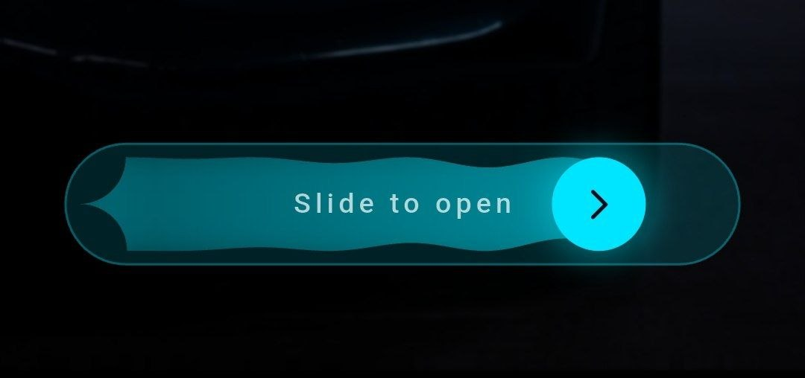
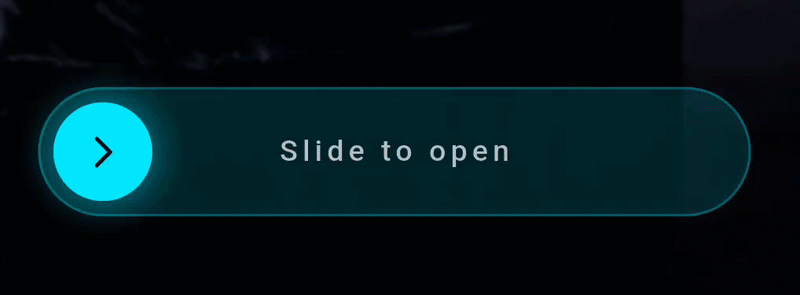
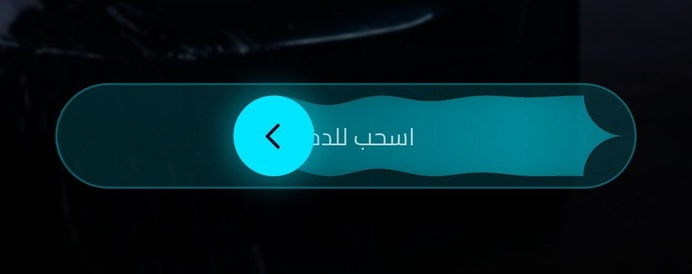

# Drag Wave Slider

A beautiful and customizable drag slider widget with animated wave trail effect for Flutter applications. Perfect for slide-to-action interactions like "slide to unlock", "slide to confirm", or any action that requires deliberate user input.

## Features

- **Animated Wave Trail**: Beautiful wave animation that follows the slider thumb
- **Live Progress Callback**: React in real-time to drag position via `onSlideChange`
- **Reset Control**: Choose whether the thumb snaps back or stays at the end after completion
- **Enable / Disable**: Fully disable interaction with a greyed-out visual state
- **Custom Thumb Widget**: Use any Flutter widget as the slider thumb
- **Custom Label Widget**: Use any Flutter widget as the slider label
- **Thumb Gradient**: Apply a gradient fill to the thumb instead of a flat color
- **RTL Support**: Works seamlessly with right-to-left layouts
- **Smooth Performance**: Wave path uses Bézier curves instead of per-pixel rendering
- **Zero Dependencies**: Only depends on Flutter SDK

## Screenshots

### LTR (Left-to-Right)



### RTL (Right-to-Left)


## Installation

Add this to your package's `pubspec.yaml` file:

```yaml
dependencies:
  drag_wave_slider: ^0.1.0
```

## Usage

```dart
import 'package:drag_wave_slider/drag_wave_slider.dart';
```

### Basic

```dart
DragWaveSlider(
  text: 'Slide to Unlock',
  sliderColor: Colors.blue,
  backgroundColor: Colors.grey,
  textColor: Colors.white,
  onSlideComplete: () {
    print('Unlocked!');
  },
)
```

### Live progress with `onSlideChange`

```dart
DragWaveSlider(
  text: 'Drag me',
  sliderColor: Colors.orange,
  onSlideComplete: () {},
  onSlideChange: (double value) {
    // value is 0.0 – 1.0
    print('Progress: ${(value * 100).toStringAsFixed(1)}%');
  },
)
```

### Keep thumb at end (`resetOnComplete: false`)

```dart
DragWaveSlider(
  text: 'Slide to Confirm',
  sliderColor: Colors.green,
  resetOnComplete: false,
  onSlideComplete: () {
    // thumb stays at the end position
  },
)
```

### Disabled state

```dart
DragWaveSlider(
  text: 'Unavailable',
  enabled: false,
  onSlideComplete: () {},
)
```

### Thumb gradient

```dart
DragWaveSlider(
  text: 'Slide to Pay',
  sliderColor: Colors.teal,
  thumbIcon: Icons.payment,
  thumbGradient: LinearGradient(
    colors: [Colors.teal, Colors.cyan],
    begin: Alignment.topLeft,
    end: Alignment.bottomRight,
  ),
  onSlideComplete: () {},
)
```

### Custom thumb widget

```dart
DragWaveSlider(
  text: 'Custom Thumb',
  sliderColor: Colors.deepPurple,
  thumbWidget: Container(
    decoration: BoxDecoration(
      shape: BoxShape.circle,
      gradient: LinearGradient(
        colors: [Colors.deepPurple, Colors.pink],
      ),
    ),
    child: Icon(Icons.star, color: Colors.white),
  ),
  onSlideComplete: () {},
)
```

### Custom label widget

```dart
DragWaveSlider(
  textWidget: Row(
    mainAxisSize: MainAxisSize.min,
    children: [
      Icon(Icons.lock_open, size: 16, color: Colors.green),
      SizedBox(width: 6),
      Text('SLIDE TO UNLOCK',
          style: TextStyle(color: Colors.green, letterSpacing: 1.5)),
    ],
  ),
  sliderColor: Colors.green,
  onSlideComplete: () {},
)
```

### RTL support

```dart
Directionality(
  textDirection: TextDirection.rtl,
  child: DragWaveSlider(
    text: 'اسحب للفتح',
    sliderColor: Colors.purple,
    onSlideComplete: () {},
  ),
)
```

## Parameters

| Parameter | Type | Default | Description |
|-----------|------|---------|-------------|
| `text` | `String?` | — | Text label (required if `textWidget` is not set) |
| `textWidget` | `Widget?` | `null` | Custom widget label (overrides `text`) |
| `onSlideComplete` | `VoidCallback` | required | Callback when slider reaches threshold |
| `onSlideChange` | `ValueChanged<double>?` | `null` | Fires continuously with drag progress (0.0–1.0) |
| `resetOnComplete` | `bool` | `true` | Whether the thumb resets to start after completion |
| `enabled` | `bool` | `true` | Whether the slider accepts user interaction |
| `sliderColor` | `Color` | `Colors.blue` | Color of slider thumb and wave trail |
| `thumbGradient` | `Gradient?` | `null` | Gradient fill for the thumb (overrides `sliderColor` on thumb) |
| `thumbWidget` | `Widget?` | `null` | Fully custom thumb widget (overrides `thumbIcon`) |
| `thumbIcon` | `IconData?` | `null` | Icon displayed inside the thumb |
| `thumbIconColor` | `Color?` | `null` | Color of the thumb icon |
| `backgroundColor` | `Color` | `Colors.grey` | Background color of the slider track |
| `textColor` | `Color` | `Colors.white` | Color of the text label |
| `height` | `double` | `60` | Height of the slider |
| `waveAmplitude` | `double` | `3.0` | Amplitude of the wave animation |
| `waveDuration` | `Duration` | `1500ms` | Duration of one wave animation cycle |
| `slideThreshold` | `double` | `0.9` | Drag fraction (0.0–1.0) that triggers `onSlideComplete` |

## Example

See the `/example` directory for a complete demo app showcasing all configurations.

## License

MIT License - see LICENSE file for details.
